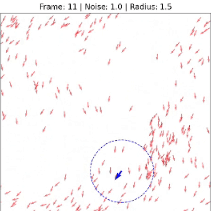

# Active Matter Simulation: Emergent Phase Transitions in Active Matter

> A vectorized, agent-based simulation engine built in Python to model collective motion, swarming, and non-equilibrium crowd dynamics.




## Abstract

This project implements a vectorized 2D simulation of the **Vicsek Model** to study non-equilibrium statistical mechanics. By modeling "agents" with local alignment rules and variable stochastic noise, the engine demonstrates how micro-scale peer interactions trigger macro-scale phase transitions. Specifically, it simulates the mathematical tipping point where a chaotic, gas-like crowd spontaneously organizes into a highly synchronized swarm or vortex—a phenomenon observable in flocking birds, bacterial colonies, and heavy metal mosh pits.

---

## The Physics Engine (Methodology)

The core simulation relies on three localized rules applied to $N$ agents within a defined spatial boundary. It utilizes Periodic Boundary Conditions (PBCs) to simulate an infinite space and eliminate edge effects.

At every time step $t$, an agent updates its heading $\theta_i$ based on the average direction of neighbors within a radius $r$, perturbed by a thermal noise scalar $\eta$:

$$\theta_i(t+1) = \text{arctan2} \left( \sum_{j \in r} \sin(\theta_j(t)), \sum_{j \in r} \cos(\theta_j(t)) \right) + \eta$$

### The Variables:

- **Density ($N$):** The concentration of active agents in the system.
- **Interaction Radius ($r$):** The spatial distance an agent looks to match the movement of their neighbors.
- **Thermal Noise ($\eta$):** The level of randomness or chaos in agent movement.

---

## Active Matter Dynamics: From Chaos to Vortex

In classical physics, particles move predictably. In "active matter" systems, particles consume energy to move and are constantly influenced by their immediate neighbors. This simulation models the phase transition between two distinct states:

- **The Disordered State (High Noise):** When the chaos factor is high, agents move erratically. They act like gas molecules, bouncing around with an average system velocity of near zero.
- **The Ordered State (Low Noise):** As the thermal noise drops below a critical threshold, the system undergoes a spontaneous phase transition. The local alignment rules overpower the randomness. Without any central leader or top-down instruction, the crowd breaks symmetry and locks into a synchronized macro-structure, forming dense moving bands or a massive circular vortex.

---

## Software Architecture & Optimization

Simulating hundreds of interacting particles can cause severe frame-rate drops if implemented with standard Python `for` loops. To handle dense crowd dynamics, this engine is optimized using linear algebra.

- **Matrix Vectorization:** Agent interactions are computed in $O(1)$ Python time using NumPy array broadcasting.
- **Adjacency Matrix Dot Products:** Angle averaging is achieved by converting the spatial neighbor mask into an adjacency matrix and utilizing `np.dot()` for highly optimized, C-level matrix multiplication of sine and cosine vectors.
- **Streamlit Dashboard:** The backend engine is decoupled from a reactive frontend, allowing real-time parameter tuning and visual rendering via Matplotlib.

---

## Running the Simulation Locally

1. Clone the repository and navigate to the directory:
   ```bash
   git clone https://github.com/GranulatedCheese/Vicsek-Stochastic-Simulation
   cd project-vortex
   ```
2. Activate a virtual environment and install dependencies:
   ```bash
   python -m venv venv
   source venv/bin/activate # On Windows use: venv\Scripts\activate
   pip install -r requirements.txt
   ```
3. Launch the Streamlit application:
   ```bash
   streamlit run app.py
   ```
